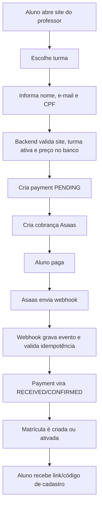
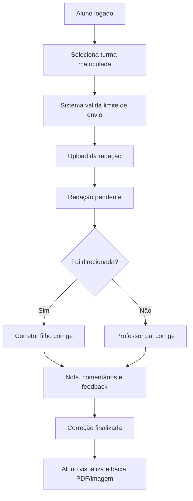
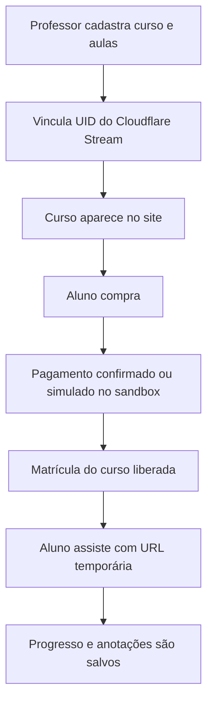

# Redação com Estratégia - Visão Completa do Sistema

Atualizado em: 2026-07-19

Este documento é o ponto de entrada para entender o projeto como um todo. Ele resume a visão do produto, arquitetura, módulos, integrações, regras de negócio, decisões técnicas, orquestração dos fluxos e cuidados para continuidade por outra IA ou outro desenvolvedor.

## Objetivo do Produto

O sistema é uma plataforma multi-tenant para professores de redação.

A plataforma principal é gerida por um superadmin. Cada professor pode ter seu próprio site público, com identidade visual, turmas, postagens, conteúdos, checkout, alunos, redações, correções, financeiro e, futuramente, cursos em vídeo.

O aluno acessa o site do professor, compra uma turma ou curso, cria cadastro ou faz login, envia redações e acompanha correções. O professor gerencia seu próprio ecossistema. O superadmin controla a plataforma geral, sites, professores, bloqueios, planos, pagamentos e validade de acesso.

## Arquitetura Oficial

- Backend: Hono em Cloudflare Workers.
- Frontend: HTML, CSS e JavaScript estático em `public/`.
- Banco: PostgreSQL via Supabase.
- Autenticação: Supabase Auth.
- Deploy: Wrangler para Cloudflare Workers.
- Worker principal atual: `cursoredacao`.
- Domínio oficial: `redacaocomestrategia.com.br`.
- DNS e SSL: Cloudflare.
- Uploads permanentes: Cloudflare R2.
- Pagamentos: Asaas, atualmente com Sandbox.
- E-mails: Brevo.
- Vídeos: Cloudflare Stream.
- Repositório: GitHub privado.

Não migrar para Node.js, Express, Nest, Docker ou VPS sem uma decisão explícita. A arquitetura oficial continua sendo Cloudflare Workers + Supabase.

## Estrutura Principal de Código

- `src/index.ts`: entrada do Worker, Hono app, rotas e middlewares globais.
- `src/config.ts`: leitura centralizada de variáveis e feature flags.
- `src/types.ts`: tipagens de ambiente e configurações.
- `src/supabase.ts`: clientes Supabase e helpers.
- `src/routes/auth.ts`: login, logout, recuperação de senha e cadastro controlado.
- `src/routes/site.ts`: site público dos professores, checkout público, CMS visual e páginas de turmas/cursos.
- `src/routes/admin.ts`: painel do professor, superadmin, turmas, alunos, correções, financeiro e CMS.
- `src/routes/aluno.ts`: painel do aluno, redações, matrículas, cursos em vídeo, progresso e anotações.
- `src/routes/payments.ts`: webhooks, sincronização e reconciliação de pagamentos Asaas.
- `src/payments.ts`: abstração de gateway de pagamentos.
- `src/email.ts`: provider de e-mail, atualmente Brevo.
- `src/storage.ts`: uploads e integração R2.
- `public/`: telas estáticas de login, professor, aluno, superadmin e assets.
- `migrations/`: evolução do schema Supabase/PostgreSQL.
- `docs/`: documentação operacional e técnica.

## Modelo Multi-Tenant

O tenant principal é o site do professor.

Cada site tem um `slug`, por exemplo:

- `/redacao/puppin-teste`
- `/redacao/puppin-teste/login`
- `/redacao/puppin-teste/app`

O campo `site_id` é a fronteira de isolamento entre professores, alunos, turmas, pagamentos, conteúdos e correções.

Regras essenciais:

- Todo professor pertence a um site.
- Todo aluno deve pertencer a um site.
- Turmas, postagens, correções, pagamentos e cursos devem ser filtrados por site.
- O backend nunca deve confiar em IDs enviados pelo navegador sem validar site, role e permissão.
- Um aluno de um site não deve acessar outro site.
- Um professor não deve acessar dados de outro professor.
- O superadmin pode gerenciar todos os sites.

## Papéis e Permissões

### Superadmin

Gerencia a plataforma inteira:

- criar, editar, inativar e excluir sites;
- criar professor e login manualmente;
- editar dados do professor;
- bloquear ou liberar sites;
- definir validade do site;
- acompanhar financeiro da plataforma;
- visualizar usuários por professor/site;
- alterar usuários quando necessário;
- preparar planos para professores.

### Professor Pai

Gerencia seu próprio site:

- layout e cores;
- turmas;
- alunos;
- postagens;
- redações;
- corretores filhos;
- pré-comentários;
- financeiro;
- relatórios;
- cursos em vídeo.

### Professor Filho / Corretor

É um corretor contratado pelo professor pai.

Regras:

- não acessa "Meu site";
- não acessa turmas, alunos, temas, relatórios ou financeiro geral do pai;
- vê apenas redações, turmas ou alunos direcionados a ele;
- pode corrigir conforme permissões dadas pelo professor pai;
- suas correções aparecem para o professor pai com tarja identificando corretor, data de atribuição e data de correção.

### Aluno

Pode:

- comprar turma ou curso;
- criar cadastro após pagamento;
- fazer login;
- enviar redações conforme limite da turma;
- acompanhar correções;
- acessar cursos em vídeo comprados;
- fazer anotações e continuar vídeo de onde parou.

Aluno inativo, bloqueado ou excluído logicamente não deve conseguir acessar o sistema.

## Site Público do Professor

Cada professor tem um site público independente, mas ligado à plataforma.

O site exibe:

- cabeçalho;
- nome/label do site;
- hero;
- bio;
- foto ou cartão do professor;
- turmas;
- conteúdos/postagens;
- cursos em vídeo;
- área do aluno;
- botão de WhatsApp;
- checkout.

O site usa as cores configuradas pelo professor:

- cor primária;
- cor de destaque;
- cores auxiliares sugeridas pelo sistema.

As turmas e postagens usam carrossel quando há muitos itens. Em mobile, os cards devem ficar centralizados entre as setas.

## Meu Site

O menu "Meu site" é a área de edição visual do site.

Ele deve conter:

- cores do site;
- cabeçalho;
- nome exibido;
- label do cabeçalho;
- etiqueta acima do título;
- título principal;
- descrição/bio;
- texto do botão principal;
- exibição do cartão/foto do professor;
- texto do cartão;
- foto do professor;
- remoção opcional de fundo da foto;
- seção de turmas;
- seção de conteúdos/postagens;
- área do aluno;
- pré-visualização fiel ao site público;
- botão de salvar alterações não salvas em destaque.

Conteúdos/Postagens não ficam dentro de "Meu site" como edição recorrente. Eles têm menu próprio no painel lateral.

## Conteúdos e Postagens

Cada professor possui seus próprios conteúdos.

Funcionalidades:

- listar publicações;
- criar;
- editar;
- ocultar/publicar;
- excluir;
- usar editor rico no corpo do texto;
- inserir links;
- inserir imagens;
- formatar fonte, tamanho, cor, fundo, alinhamento, marcadores, numeração, sublinhado e destaques.

O conteúdo publicado aparece no site público do professor. Textos longos devem ser truncados no card e abrir em página própria para leitura completa.

## Turmas

Turmas são criadas pelo professor e pertencem a um site.

Campos importantes:

- nome;
- descrição;
- preço;
- status ativo/oculto/inativo;
- vagas;
- imagem de capa;
- se aparece no site;
- limites de redação por aluno;
- quantidade permitida;
- periodicidade: por dia, por semana ou a cada X dias;
- formas de pagamento permitidas;
- parcelas no cartão;
- quem paga taxas;
- textos da página de detalhes.

Regras:

- preço usado no checkout sempre vem do banco;
- nunca confiar no valor enviado pelo navegador;
- uma turma sem alunos pode ser excluída;
- se houver alunos vinculados, o sistema deve orientar o professor a desvincular antes;
- o aluno só pode enviar redação para turmas em que está matriculado;
- o professor pode adicionar aluno a uma ou mais turmas.

## Checkout e Matrícula

O fluxo comercial deve funcionar assim:

1. Aluno escolhe turma ou curso no site público.
2. Informa nome, e-mail e CPF.
3. O sistema valida CPF em tempo real.
4. O backend identifica site, professor e item comprado.
5. O backend busca o preço diretamente no banco/CMS.
6. Cria ou localiza lead/aluno.
7. Cria registro interno em `payments`.
8. Gera `externalReference` única.
9. Cria cobrança no Asaas.
10. Mostra as formas de pagamento permitidas.
11. Pagamento fica `PENDING`.
12. O retorno do navegador não libera acesso em produção.
13. Somente webhook confirmado libera matrícula.
14. Após confirmação, cria ou ativa matrícula uma única vez.
15. Envia e-mail com link/código para cadastro.
16. Aluno cria cadastro ou faz login.

Em Sandbox, alguns fluxos podem simular recebimento para acelerar homologação. Em produção, a liberação deve depender do Asaas.

## Asaas

Integração atual:

- ambiente Sandbox ativo;
- webhook publicado em `/api/payments/asaas/webhook`;
- token validado por `ASAAS_WEBHOOK_TOKEN`;
- eventos gravados em `payment_webhook_events`;
- pagamentos gravados em `payments`;
- idempotência obrigatória;
- somente eventos equivalentes a pagamento recebido/confirmado liberam acesso.

Eventos de liberação:

- `PAYMENT_RECEIVED`;
- `PAYMENT_CONFIRMED`;
- estado normalizado equivalente, como `RECEIVED_IN_CASH`, quando aplicável.

O webhook deve:

- retornar 401 se token inválido;
- retornar 400 se payload inválido;
- retornar 200 para evento autenticado e válido;
- gravar sempre o evento;
- se o pagamento local ainda não existir, marcar para reconciliação sem falhar;
- não processar o mesmo evento duas vezes.

## Financeiro

O financeiro contempla:

- receita recebida;
- custos com corretores filhos;
- saldo antes de taxas;
- valores a pagar;
- fechamentos;
- pagamentos;
- auditoria.

O professor pai vê:

- quanto vendeu;
- quais alunos pagaram;
- qual turma/curso foi comprado;
- forma de pagamento;
- status;
- data do pagamento;
- quanto deve a cada corretor filho;
- saldo projetado.

O corretor filho vê apenas o que diz respeito ao próprio trabalho, quando permitido.

Os textos do financeiro devem evitar códigos técnicos como `CHILD_TURMA` ou `LEGACY_CHILD_CMS` na interface. Quando existirem regras internas, devem aparecer traduzidas em linguagem simples, com ícones de informação.

## Redações e Correção

Fluxo:

1. Aluno matriculado envia redação.
2. Sistema valida turma e limite de envio.
3. Arquivo é salvo no armazenamento configurado.
4. Redação aparece como pendente para professor ou corretor designado.
5. Professor/corretor abre tela completa de correção.
6. Pode marcar com retângulo, mão livre e sublinhado.
7. Ao marcar, abre comentário.
8. Comentários podem usar pré-comentários cadastrados.
9. Feedback geral pode usar comentários gerais.
10. Nota e feedback são obrigatórios para finalizar.
11. Depois de finalizada, a correção fica bloqueada para novas marcações.
12. Se reabrir correção, novas edições são permitidas.
13. Aluno visualiza a correção em tela adequada, não popup.
14. Professor/aluno podem baixar imagem ou PDF corrigido.

Pontos importantes:

- status "Em andamento" conta como pendente;
- se já houver nota, não permitir novas marcações sem reabrir;
- botão limpar deve confirmar antes de remover comentários;
- comentários e marcações devem permanecer visíveis após salvar;
- mão livre deve aparecer na visualização, nos comentários e nos downloads.

## Pré-Comentários e Corretor Automático

Cada professor deve ter seu próprio banco de comentários.

Submenus:

- Marcação no corpo do texto;
- Comentários gerais.

Regras:

- comentários da `puppin-teste` não devem aparecer para outros sites;
- busca deve ordenar pelos mais usados;
- comentário selecionado preenche o campo e ainda permite complemento manual;
- exportação e importação devem adicionar registros sem sobrescrever.

## Cursos em Vídeo

Objetivo: permitir que professores vendam cursos em vídeo dentro do próprio site.

Base atual:

- Cloudflare Stream habilitado;
- professor cadastra curso e aulas;
- vídeo usa UID do Cloudflare Stream;
- aluno compra curso;
- aluno acessa curso no painel;
- progresso do vídeo é salvo;
- aluno pode continuar de onde parou;
- aluno pode fazer anotações por aula.

Proteções:

- usar vídeos privados no Cloudflare Stream;
- gerar acesso temporário pelo Worker;
- evitar expor token administrativo;
- não prometer bloqueio absoluto contra gravação de tela;
- no futuro, adicionar marca d'água com nome/e-mail/CPF do aluno.

Custo:

- Cloudflare Stream cobra armazenamento e minutos entregues;
- se o aluno assiste 10h três vezes, isso conta como 30h entregues;
- preço dos cursos deve considerar reassistência normal.

## Uploads

Regra de produção:

- uploads permanentes devem ir para R2;
- não salvar novos arquivos permanentes em base64 no banco;
- validar MIME real;
- validar tamanho decodificado;
- usar `MAX_UPLOAD_BYTES`;
- bloquear extensões perigosas;
- se `ENABLE_R2_UPLOADS=false` em produção, bloquear novos uploads com mensagem controlada.

Base64 antigo pode existir no banco, mas não deve ser a solução definitiva.

## E-mails

Provider atual: Brevo.

Uso:

- recuperação de senha;
- link de cadastro pós-pagamento;
- notificações futuras;
- e-mails de transação.

Variáveis:

- `ENABLE_EMAILS`;
- `EMAIL_PROVIDER=brevo`;
- `EMAIL_FROM`;
- `BREVO_API_KEY`.

Regras:

- não usar WhatsApp para redefinição de senha;
- recuperação deve ser apenas por e-mail;
- após solicitar redefinição, mostrar mensagem clara e links para abrir Gmail, Outlook/Hotmail e outros provedores principais;
- não listar UOL ou Terra;
- e-mail deve estar em português;
- o link precisa respeitar a configuração de URL do Supabase.

## Supabase Auth

O Supabase Auth é a fonte de autenticação.

Regras:

- não trocar a autenticação sem decisão explícita;
- Google/OAuth foi removido/desativado;
- cadastro público direto é bloqueado;
- cadastro de aluno só ocorre após pagamento/matrícula;
- senha mínima de aluno: 6 caracteres;
- login e cadastro nunca devem aparecer juntos;
- recuperação de senha deve usar Site URL e Redirect URLs corretas no Supabase.

## Segurança

Medidas já estruturadas:

- segredos removidos do código;
- `.env.example` sem valores reais;
- leitura centralizada de variáveis;
- validação de `SESSION_SECRET`;
- feature flags;
- `/health` sem vazar informações sensíveis;
- legacy Supabase service keys desativadas;
- nova secret key Supabase em uso;
- publishable key no lugar da anon legacy;
- uploads com validação;
- webhooks Asaas com token e idempotência;
- isolamento multi-tenant por `site_id`.

Cuidados pendentes ou contínuos:

- limpar histórico Git se ainda houver segredos antigos em commits;
- manter Cloudflare secrets atualizados;
- não imprimir tokens em logs;
- não expor banco publicamente;
- aplicar rate limiting real via Cloudflare/Durable Objects, não memória local;
- revisar IDOR sempre que criar novas rotas;
- validar permissões no backend, não apenas na UI.

## Feature Flags Importantes

- `ENABLE_PAYMENTS`;
- `ENABLE_PUBLIC_CHECKOUT_SIMULATED`;
- `ENABLE_R2_UPLOADS`;
- `ENABLE_EMAILS`;
- `ENABLE_OAUTH`;
- `ENABLE_VIDEO_COURSES`;
- `ENABLE_CLOUDFLARE_STREAM`;
- `APP_ENV`;
- `APP_URL`;
- `APP_VERSION`.

Em produção, simulações devem ficar desligadas, salvo decisão explícita.

## Orquestração dos Principais Fluxos

### Compra de Turma

### Envio e Correção de Redação

### Curso em Vídeo

## Decisões de Engenharia

- Manter stack atual para publicar rápido.
- Evitar reescrita.
- Centralizar regras sensíveis no backend.
- Separar desenvolvimento, homologação e produção por variáveis.
- Usar feature flags para funcionalidades incompletas.
- Não depender de armazenamento local do container, pois Workers não têm filesystem persistente.
- Usar R2 para arquivos e Stream para vídeos.
- Usar Asaas como gateway, mas manter abstração para facilitar troca futura.
- Tratar professor como tenant, não como simples usuário.
- Manter documentação operacional em `docs/`.

## Estado dos Documentos Existentes

Documentos já existentes e complementares:

- `docs/ARCHITECTURE.md`: arquitetura técnica.
- `docs/PROJECT_STATUS.md`: estado do projeto.
- `docs/CHANGELOG.md`: histórico de mudanças.
- `docs/ASAAS.md`: integração Asaas.
- `docs/ASAAS_PRODUCTION.md`: preparação para produção Asaas.
- `docs/EMAILS.md`: e-mails e Brevo.
- `docs/VIDEO_COURSES.md`: cursos em vídeo e Stream.
- `docs/FINANCIAL_MODULE.md`: módulo financeiro.
- `docs/R2.md`: uploads no R2.
- `docs/SECURITY.md`: segurança.
- `docs/SECURITY_RUNBOOK.md`: operação de segurança.
- `docs/DOMAIN.md`: domínio e Cloudflare.
- `docs/DEPLOY.md`: deploy.
- `docs/TEST_PLAN.md`: plano de testes.
- `docs/LAUNCH_CHECKLIST.md`: checklist de lançamento.
- `docs/BLOCKERS.md`: bloqueios.
- `docs/ROADMAP.md`: próximos passos.

Este arquivo não substitui esses documentos. Ele é o índice narrativo e conceitual do sistema.

## Pendências Relevantes

- Confirmar se todo histórico Git comprometido foi limpo.
- Validar Asaas em produção antes de ativar pagamentos reais.
- Finalizar upload real de vídeos pelo painel do professor usando Direct Creator Uploads do Cloudflare Stream.
- Garantir que todos os arquivos de redação novos usem R2.
- Revisar responsividade de páginas críticas após cada grande mudança.
- Endurecer rate limiting com Cloudflare.
- Criar testes automatizados mais amplos para multi-tenant, financeiro e checkout.
- Criar política clara de exclusão/inativação de alunos, turmas e sites.
- Definir planos comerciais dos professores e validade automática do site.
- Adicionar relatórios PDF mais completos.
- Revisar textos finais para produção.

## Como Retomar o Projeto

Antes de continuar desenvolvimento:

1. Abrir o projeto em `C:\Users\adm.sloannascimento\Downloads\puppin\cursoredacao`.
2. Rodar `git status`.
3. Ler este arquivo.
4. Ler `docs/PROJECT_STATUS.md`.
5. Ler `docs/CHANGELOG.md`.
6. Verificar `.dev.vars` local, sem imprimir segredos.
7. Rodar `npm run check:all`.
8. Testar o Worker local ou publicado, conforme o ciclo.
9. Não executar migrations sem revisar.
10. Não fazer deploy ou push se houver testes quebrando.

## Regras Para Outra IA ou Desenvolvedor

- Não reescrever o sistema do zero.
- Não trocar a stack.
- Não mover para Docker/VPS.
- Não inserir segredos no código.
- Não confiar em dados do navegador para preço, site, professor ou permissão.
- Não criar cadastro público sem pagamento/matrícula.
- Não liberar acesso por retorno do navegador em produção.
- Não misturar dados entre sites.
- Não mostrar login e cadastro na mesma tela.
- Não alterar schema sem migration documentada.
- Não fazer deploy sem `npm run check:all`.
- Não fazer push com segredos ou arquivos temporários.

## Resumo Executivo

O projeto já é uma plataforma SaaS educacional multi-tenant em Cloudflare Workers, com Supabase Auth/PostgreSQL, sites independentes por professor, checkout Asaas, e-mails Brevo, R2 para arquivos e Cloudflare Stream para cursos em vídeo.

A prioridade técnica contínua é preservar isolamento entre professores, alunos, turmas e pagamentos; manter as integrações atrás de feature flags; e evoluir em ciclos pequenos, testáveis e documentados.
